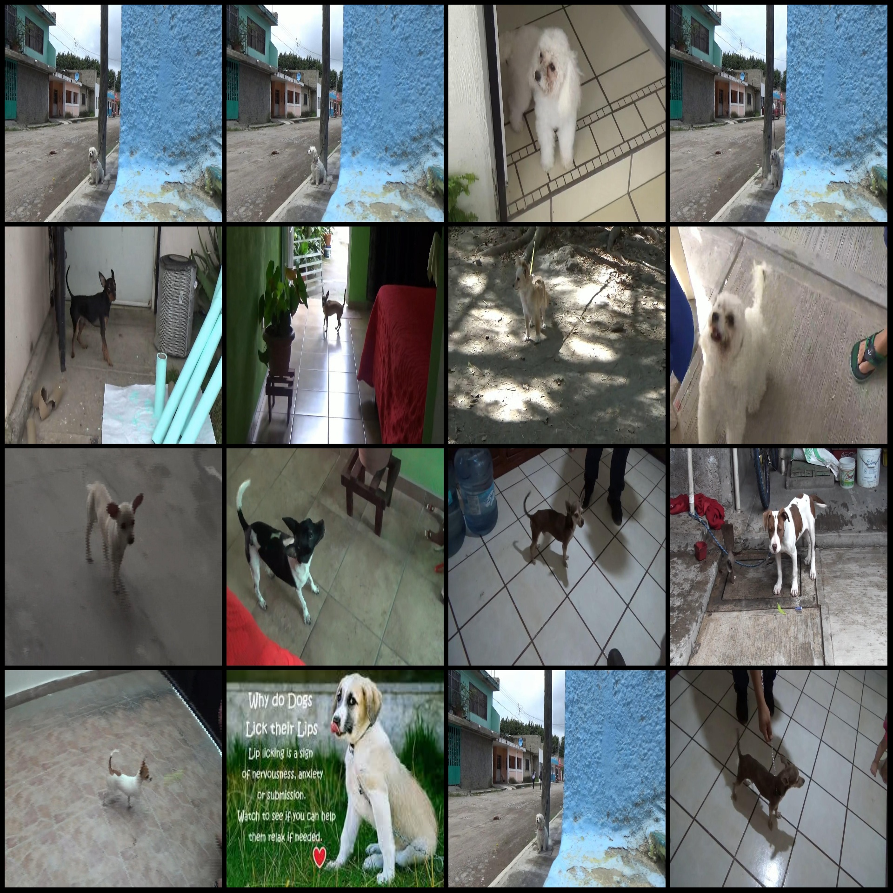
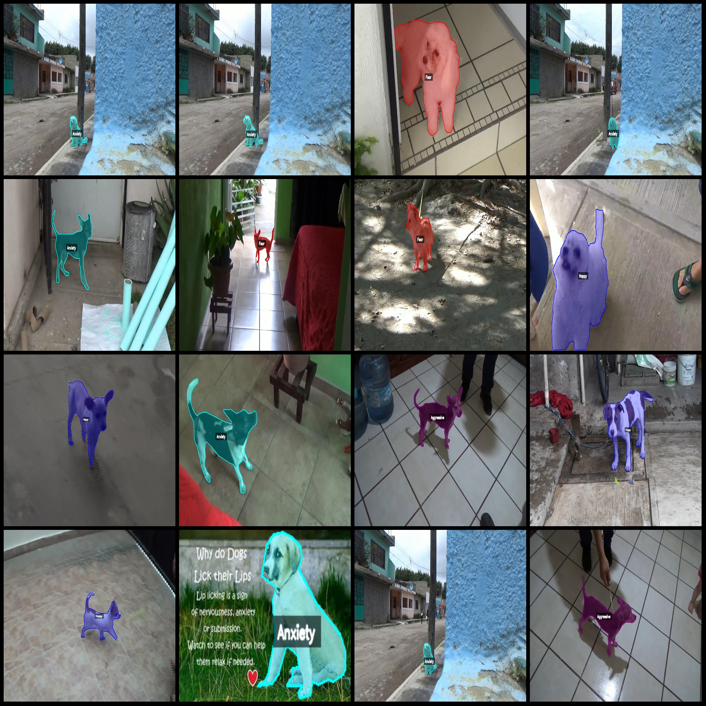
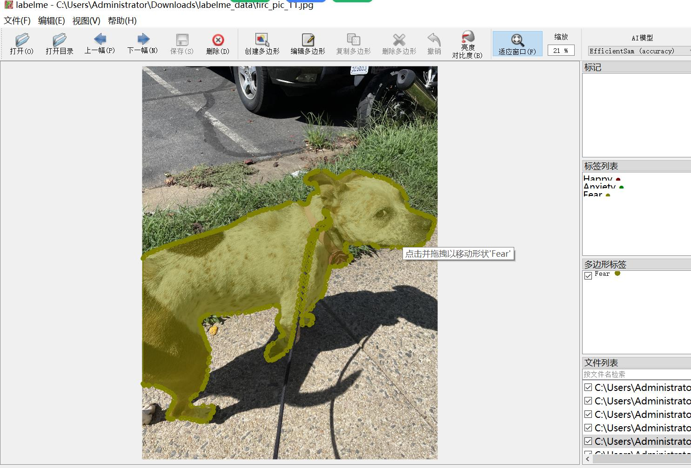

# Dataset for Dog Emotion Recognition and Segmentation in labelme Format: 2083 Images, 4 Categories

**Dataset Format:** labelme format (without mask files, only containing jpg images and corresponding json files)

- **Number of Images (Jpg Files):** 2083
- **Number of Annotations (Json Files):** 2083
- **Number of Annotation Categories:** 4
- **Annotation Category Names:** ["Aggressive", "Anxiety", "Fear", "Happy"]
- **Box Count per Category:**
- Aggressive count = 152
  - Anxiety count = 927
  - Fear count = 493
  - Happy count = 565
- **Total Boxes:** 2137

**Labeling Tool:** labelme v5.5.0

**Image Resolutions:** Multi-resolution images, such as 1920x1080, 1280x720, etc.

**Annotation Rules:** Polygon drawing for categories

**Important Notice:** The dataset can be opened and edited using labelme. The json dataset needs to be converted into either mask or yolo format or coco format for semantic segmentation or instance segmentation.

**Special Disclaimer:** This dataset does not guarantee any accuracy in the training models or weight files.

**Image Preview:**

**Annotation Examples:**

- **Original Image (randomly select 16 images):**


...
[Image 16](path_to_image_16.jpg)

**Annotation Drawing Results:**

**Example of an Edited Image with Annotations:**

```plaintext
{
    "type": "person",
    "confidence": 0.95,
    "class": "Happy",
    "bndbox": {
        "xmin": 100,
        "ymin": 100,
        "xmax": 200,
        "ymax": 200
    }
}
```
## Images






Here is a pay link on Stripe ( https://buy.stripe.com/3cs8yP7sY87d0vu9AB ). Please contact me lonlonago@foxmail.com after funding $89, and I will send you a complete data files , thank you!


